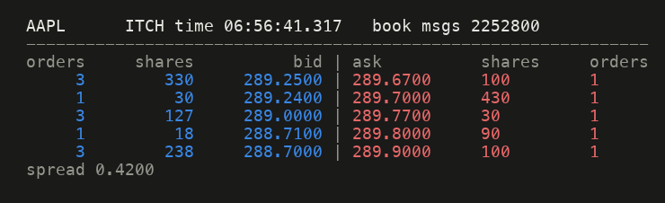
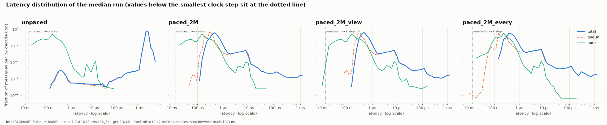
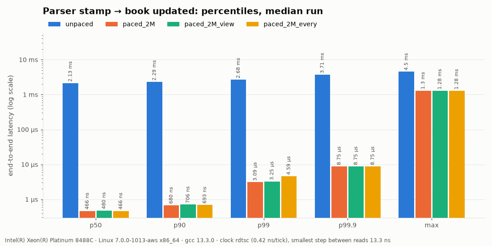
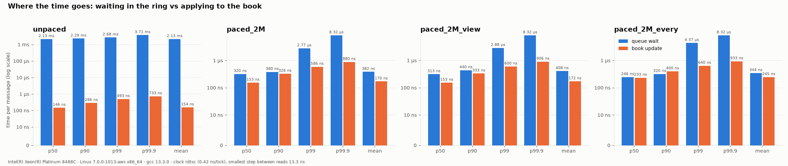
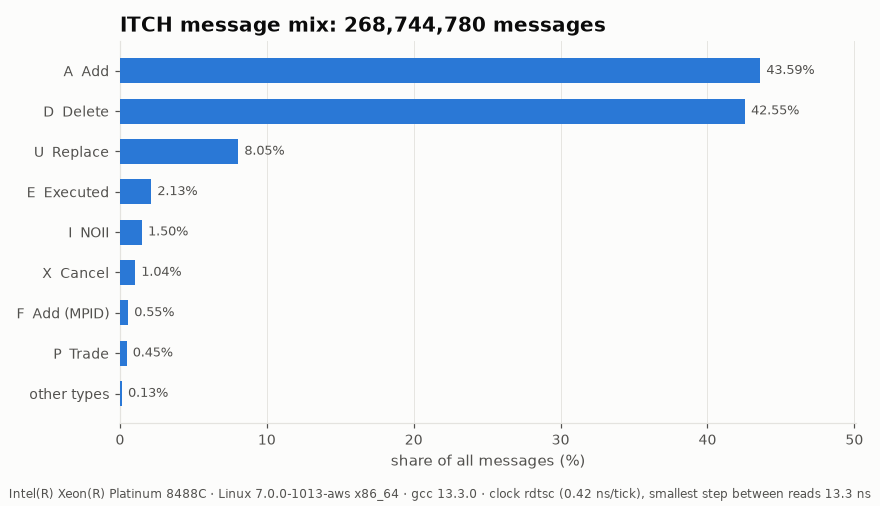
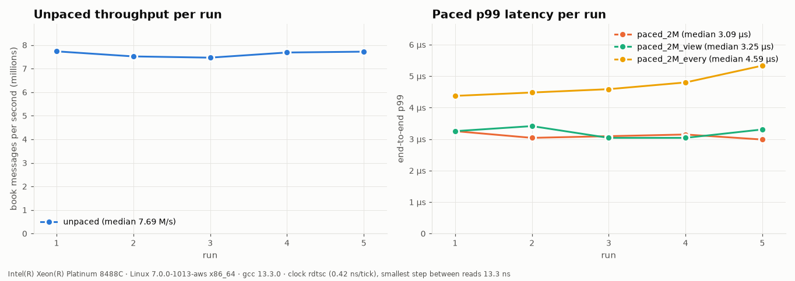
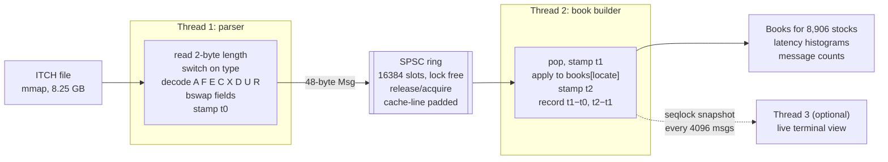

# ITCH 5.0 feed handler


[](https://github.com/Tharun-Maheswararao/itch_feed_handler/actions/workflows/ci.yml)

This program replays a full trading day of real Nasdaq TotalView-ITCH 5.0 data
(**268,744,780 messages, 8.25 GB**) through a two-thread pipeline: a parser, a
lock-free SPSC ring, and an order-book builder. It rebuilds the book for every
stock and reports end-to-end tail latency.

The optimized book is checked against a deliberately simple golden model
**after every one of the 263 M book messages**, using a running hash of book
state.

## Results

Pinned-core run on Linux, produced by the [Linux benchmark workflow](.github/workflows/benchmark.yml)
([run](https://github.com/Tharun-Maheswararao/itch_feed_handler/actions/runs/36891000656),
[summary](results/linux/SUMMARY.md)).

> **Host:** AWS `c7i.2xlarge`, Intel Xeon Platinum 8488C (4 physical / 8
> logical cores), Ubuntu 24.04 (kernel 7.0), gcc 13.3.0, `-O3 -march=native`.
> Parser and book thread **pinned to two separate physical cores**. Clock:
> `rdtsc`, 0.42 ns per tick. Latency is measured on a **random 1-in-16 sample**
> of messages (16.5 M samples per run, see below why); one configuration
> times every message for comparison.

**Correctness: the optimized two-thread pipeline equals the golden model.**

| Check | Linux, full day ([log](results/linux/logs/verify_full_day.txt)) | Mac, cut at 12:00:00 ([log](results/logs/verify_until_noon.txt)) |
|---|---|---|
| Book messages compared | 263,250,843 | 132,659,542 |
| Per-message hash chain (digest after *every* message) | ✅ identical (251 checkpoints) | ✅ identical (126 checkpoints) |
| Full book state, every level of every stock | ✅ (book is empty at end of day) | ✅ **1,771,377 live orders** |
| Invariants (level = Σ orders, sorted, no duplicates) | ✅ both books | ✅ both books |
| Unknown refs / overfills / duplicate adds | 0 / 0 / 0 | 0 / 0 / 0 |

The full-day digest `1f3f7b7bcfdf76de` is **bit-for-bit identical on x86-64
with gcc and on Apple Silicon with clang**
([Mac log](results/logs/verify_full_day.txt)): the same 263 M-message book
history is rebuilt on both.

**End-to-end latency** (parser stamp → book updated), full day, median of 5
runs after 1 warmup:

| Configuration | Timed | Throughput | p50 | p90 | p99 | p99.9 | max |
|---|---:|---:|---:|---:|---:|---:|---:|
| **unpaced** | 1/16 | **7.69 M msgs/s** (7.47–7.73) | 2.13 ms | 2.29 ms | 2.68 ms | 3.71 ms | 4.50 ms |
| **paced 2 M msgs/s** | 1/16 | 2.00 M msgs/s | **466 ns** | **680 ns** | **3.09 µs** | 8.75 µs | 1.30 ms |
| paced 2 M msgs/s, **live view on** | 1/16 | 2.00 M msgs/s | 480 ns | 706 ns | 3.25 µs | 8.75 µs | 1.28 ms |
| paced 2 M msgs/s, every message timed | all | 2.00 M msgs/s | 466 ns | 693 ns | 4.59 µs | 8.75 µs | 1.28 ms |

Across the five paced runs: p50 466 ns in every run, p90 680 ns, and **p99
2.99–3.25 µs**. Book update alone (t2 − t1): p50 150–153 ns, p99 586–600 ns.
At 2 M msgs/s the ring never held more than 5,307 messages at a sample.

**Components** ([micro_bench log](results/linux/logs/micro_bench.txt)), single
threaded unless noted:

| Component | Cost |
|---|---|
| Parser | **10.3 ns/msg: 97 M msgs/s**, 3.0 GB/s (full file in page cache) |
| Golden book (`unordered_map` + `std::map`) | 319 ns per book message |
| Fast book (open addressing + sorted vectors) | **86 ns per book message, 3.7× faster** |
| SPSC ring, 48-byte messages, 2 threads, unpinned | 45.6 ns/msg at batch 1, 25.7 at batch 8, 16.4 at batch 32 |

**How to read this:**

* **Pinning makes the tail repeatable.** On the unpinned Mac, paced p99 ranged
  from 0.5 µs to 193 ms between runs. Pinned on Linux, over the full day
  rather than a slice, it stayed within 3.0–3.3 µs, and the every-message p99
  (4.59 µs) reproduced the first Linux run (4.48 µs) on a different physical
  host. Stamps use the *scheduled* arrival time (coordinated-omission
  correction), so stalls are charged to latency rather than hidden.
* **Why sample.** Timing a message costs two `rdtsc` reads and three histogram
  updates, about as much as the book update itself. Timing every message
  measured a pipeline running at half speed: unpaced throughput was 3.18 M
  msgs/s, and the book thread's extra busy time added queueing that pushed
  paced p99 to 4.4–5.3 µs. With a random 1-in-16 sample, unpaced throughput
  is 7.69 M msgs/s (what the untimed pipeline does) and p99 is 3.0–3.3 µs.
  p50, p99.9 and max are unchanged, so sampling does not hide spikes: each
  timed message also records the ring depth, and a stall delays every message
  behind it.
* **The split between queue wait and book update is approximate.** `rdtsc`
  does not wait for earlier instructions to finish, so where "queue" ends and
  "book" begins is only good to tens of nanoseconds. Sampled and
  every-message runs have the same end-to-end p50 (466 ns) but split it
  320 + 153 and 246 + 233 ns. Use the end-to-end figures.
* **Unpaced is a throughput test.** The parser is about 8× faster than the
  book, so the ring stays full and each message waits behind the ~16k ahead
  of it. The 2.1 ms "latency" is that backlog (16384 × 130 ns), not a
  property of the code.
* **The live view does not affect the pipeline.** With it on, p99 is
  3.04–3.41 µs against 2.99–3.25 µs off: the ranges overlap.
* **Why the pipeline costs more per message than its parts: diagnosed.**
  Single threaded, the fast book costs 82.5 ns per message, but inside the
  pipeline a book update took 220–280 ns. A dedicated run
  ([report](results/linux/diagnose/DIAGNOSE.md), pinned, 04:00–12:00, 132.7 M
  book messages) separated the causes:

  | Experiment (same instance) | Consumer cost | Throughput |
  |---|---:|---:|
  | Single thread, untimed | 123 ns/msg | 8.16 M/s |
  | Single thread, timed with the pipeline's own clock reads | 220 ns/msg | 4.55 M/s |
  | Pipeline, untimed | 135 ns/msg | 7.41 M/s |
  | Pipeline, every message timed | 255 ns/msg | 3.92 M/s |
  | Pipeline, timed, ring batch 8 | 232 ns/msg | 4.31 M/s |
  | Pipeline, timed, both threads on one core's hyperthreads | 241 ns/msg | 4.15 M/s |

  1. **Measuring every message is the main cost.** Two `rdtsc` reads and three
     histogram updates per message nearly halve throughput, single threaded
     (123 → 220 ns) and in the pipeline (7.41 → 3.92 M/s) alike, partly
     because they stop the CPU overlapping one message's cache misses with
     the next. Untimed, the pipeline is within 10% of the single thread.
  2. **Cross-core traffic is real but small.** Publishing the ring indices
     every 8 messages instead of every message adds 6–10% throughput and cuts
     the extra L1 misses caused by the ring by 76% (`perf stat`), and raw ring
     transfer drops from 92.5 to 17.1 ns per message at batch 32. Moving both
     threads onto one physical core gains only 6%.
  3. **Memory is not the difference.** dTLB misses are the same with and
     without the pipeline (about 0.14 per message: the huge pages work), and
     context switches stay under 200 per run (pinning holds).

  At 2 M msgs/s batching did not help: p50 was 506 ns either way, and p99 was
  5.9–6.1 µs at batch 1 against 6.3–7.3 µs at batch 32. The default therefore
  stays at batch 1; `--ring-batch 8` is the throughput setting. The fix for
  the measurement cost is the sampling now used above.

### Charts

Built from [`results/linux/`](results/linux) by `python3 scripts/plot_results.py --results results/linux --out docs/linux`.







### Apple M4 results (unpinned, indicative)

Same code on a MacBook Pro (Apple M4, 4 performance + 6 efficiency cores,
16 GB RAM, macOS 15.6.1, Apple clang 17, `-O3 -mcpu=native`). macOS cannot pin
threads, the 8.25 GB file did not fit in page cache next to other apps, and the
`cntvct_el0` counter advances in 41.67 ns steps. Paced runs therefore replay
04:00–10:00, which includes the open and fits in RAM.

| Configuration | Book msgs | Throughput | p50 | p90 | p99 | p99.9 | max |
|---|---:|---:|---:|---:|---:|---:|---:|
| unpaced, full day | 263.3 M | 7.10 M msgs/s (7.07–7.21) | 2.23 ms | 2.42 ms | 3.08 ms | 5.51 ms | 21.5 ms |
| paced 2 M msgs/s, 04:00–10:00 | 38.0 M | 2.00 M msgs/s | 183 ns | 263 ns | 607 ns | 4.85 ms | 9.00 ms |
| paced 2 M msgs/s, live view on | 38.0 M | 2.00 M msgs/s | 183 ns | 263 ns | 527 ns | 1.28 ms | 3.27 ms |

Book update alone: p50 125 ns, p99 335–375 ns. Fast book 63–67 ns against
274–352 ns for the golden model (4.1–5.6×); parser about 5 ns/msg from page
cache. Paced p99 swung from 471 ns to 52 µs across runs in this session, and up
to 193 ms in an earlier, more heavily loaded one. The M4 is faster per message;
only pinned Linux gives a repeatable tail. CSVs: [`results/`](results); charts:
[histogram](docs/latency_histogram.png), [percentiles](docs/latency_percentiles.png),
[breakdown](docs/latency_breakdown.png), [stability](docs/throughput_runs.png).
An earlier attempt at 5 M msgs/s over the full day (74% load, paging from SSD)
is kept in [`results/logs/first_attempt_paced_5M/`](results/logs/first_attempt_paced_5M).

### Reproducing on Linux

The benchmark spec calls for Linux with pinned cores. On a compute-optimized
EC2 instance (e.g. `c7i.2xlarge`, or `c7g` for Graviton) with at least 16 GB
RAM, so the whole day stays in page cache:

```bash
sudo dnf install -y gcc-c++ cmake git python3-pip && pip3 install pandas matplotlib pillow
git clone https://github.com/Tharun-Maheswararao/itch_feed_handler.git && cd itch_feed_handler
curl -L -o data/12302019.NASDAQ_ITCH50.gz "https://emi.nasdaq.com/ITCH/Nasdaq%20ITCH/12302019.NASDAQ_ITCH50.gz" && gunzip -k data/12302019.NASDAQ_ITCH50.gz
sudo cpupower frequency-set -g performance   # optional: stable clocks
bench/run_benchmark.sh data/12302019.NASDAQ_ITCH50
```

On Linux the script pins the parser and book threads to two physical cores and
replays the **full day** in every configuration. It writes the CPU model, core
count, compiler, flags and clock to every CSV row and regenerates every chart
in `docs/`.

**Or let GitHub Actions do it.** The [Linux benchmark](.github/workflows/benchmark.yml)
workflow launches a temporary EC2 instance, runs all of the above with pinned
cores, uploads the results as an artifact, opens a pull request adding
`results/linux/` and `docs/linux/`, and always terminates the instance. It
costs about $0.50 per run. One-time AWS setup:
[docs/AWS_BENCHMARK.md](docs/AWS_BENCHMARK.md).


## Architecture



| Component | Implementation | File |
|---|---|---|
| Parser | mmap, length-prefixed walk, `memcpy`+`bswap`, decodes only the 8 book types, counts all 23 | [`parser.hpp`](include/fh/parser/parser.hpp) |
| Message | 48 bytes, fixed size: cycle stamp, ITCH time, ref, new ref or symbol, price, shares, locate, type, side | [`message.hpp`](include/fh/parser/message.hpp) |
| SPSC ring | power-of-two, owner-written head and tail on separate cache lines, cached opposite index, release/acquire, busy spin | [`spsc_queue.hpp`](include/fh/queue/spsc_queue.hpp) |
| Golden book | `std::unordered_map` + `std::map` per side: the reference, never optimized | [`golden_book.hpp`](include/fh/book/golden_book.hpp) |
| Fast book | open-addressing order map (Fibonacci hash, backward-shift delete) + sorted level vectors, touch at the back | [`fast_book.hpp`](include/fh/book/fast_book.hpp), [`order_map.hpp`](include/fh/book/order_map.hpp) |
| Latency | `rdtsc` / `cntvct_el0` / `steady_clock`, log-linear fixed-array histogram, no allocation | [`clock.hpp`](include/fh/stats/clock.hpp), [`histogram.hpp`](include/fh/stats/histogram.hpp) |
| Live view | seqlock snapshot, own thread, ANSI redraw once per second | [`seqlock.hpp`](include/fh/view/seqlock.hpp), [`live_view.cpp`](src/live_view.cpp) |

Every design choice, and what I would change next, is in **[docs/DESIGN.md](docs/DESIGN.md)**.

## Build and run

Requirements: a C++20 compiler (clang ≥ 15 or gcc ≥ 12), CMake ≥ 3.20, and
Python 3 with pandas, matplotlib and Pillow for the charts. GoogleTest is
fetched automatically.

```bash
cmake -S . -B build -DCMAKE_BUILD_TYPE=Release && cmake --build build -j
ctest --test-dir build --output-on-failure
```

Get the data (see [data/README.md](data/README.md)):

```bash
curl -L -o data/12302019.NASDAQ_ITCH50.gz "https://emi.nasdaq.com/ITCH/Nasdaq%20ITCH/12302019.NASDAQ_ITCH50.gz" && gunzip -k data/12302019.NASDAQ_ITCH50.gz
```

| Command | What it does |
|---|---|
| `feed_handler count FILE --repeat 2` | parse only; message mix; checks counts match across passes |
| `feed_handler golden FILE --at 10:00:00,15:59:00` | single-threaded golden model; invariants; top of book at given times |
| `feed_handler verify FILE [--until 12:00:00]` | golden vs two-thread pipeline: per-message hash chain + full book state |
| `feed_handler bench FILE --runs 5 --warmup 1 [--rate N] [--cpu-producer A --cpu-consumer B]` | timed runs, median, CSVs |
| `feed_handler bench FILE --runs 1 --warmup 0 --view AAPL --speedup 5 --pace-from 09:30:00 --out results/logs/demo_view` | the live terminal view |
| `feed_handler single FILE [--timed] [--cpu N]` | single-threaded parse + book; `--timed` adds the pipeline's per-message clock reads |
| `feed_handler bench … --sample-every 16` | time a random 1-in-16 sample of messages (the benchmark default); `1` times every message |
| `feed_handler bench … --ring-batch 32 --no-latency` | ring index batching; throughput-only run without per-message timing |
| `bench/diagnose.sh FILE` | pipeline-overhead experiments (batching, SMT siblings, timing on/off, `perf stat`) |
| `feed_handler gen OUT --events N` | synthetic ITCH feed (used by CI) |
| `micro_bench FILE` | parse-only, golden vs fast book, raw SPSC transfer |

**Everything (benchmarks, CSVs and all five charts) from one command:**

```bash
bench/run_benchmark.sh data/12302019.NASDAQ_ITCH50
```

On Linux the script pins the parser and the book thread to two physical cores
(never core 0, never hyperthread siblings). To regenerate the charts from
existing CSVs, run `python3 scripts/plot_results.py`.

## Testing

| Test | What it proves |
|---|---|
| [`test_parser`](tests/test_parser.cpp) | every field of every book type decodes correctly from hand-written bytes, including byte order, the 48-bit timestamp, and price scaling (`1234500` → `$123.45`); skip, malformed and truncated paths |
| [`test_spsc_queue`](tests/test_spsc_queue.cpp) | every item arrives once and in order on rings of 2, 64 and 16384 slots (**2.5 billion items run locally**, set with `FH_SPSC_ITEMS`); 48-byte payloads never tear |
| [`test_order_map`](tests/test_order_map.cpp) | 400k-step random churn against `std::unordered_map`, wrap-around, backward-shift delete, growth |
| [`test_book`](tests/test_book.cpp) | the same edge cases on **both** books: replace that moves level, replace priced through the other side (stays on its side), execution that empties a level, delete of the last order (hash returns to 0), unknown refs, overfill, deep books |
| [`test_golden_compare`](tests/test_golden_compare.cpp) | fast book equals golden after every message; the two-thread pipeline (fast and golden books, paced and unpaced, view on) produces the identical per-message hash chain |
| Invariants | each level's shares and order count equal the sum of its orders, levels are strictly sorted, no order is in two places |
| [`test_histogram`](tests/test_histogram.cpp), [`test_seqlock`](tests/test_seqlock.cpp) | bucket math and error bound; no torn snapshot across 3M concurrent writes |

CI ([`.github/workflows/ci.yml`](.github/workflows/ci.yml)) runs on every
push. It builds with gcc and clang on Linux and clang on macOS, in Release and
Debug, and runs ASan+UBSan and TSan builds. An end-to-end job generates a
synthetic feed and runs count → golden → verify → bench → charts.

## Repository layout

```
include/fh/parser/   endian helpers, message struct, parser, mmap wrapper
include/fh/queue/    SPSC ring buffer
include/fh/book/     golden book, fast book, order map, hashing, comparison
include/fh/stats/    clock, histogram, report/CSV
include/fh/view/     seqlock, snapshot, live view
include/fh/testing/  ITCH encoder + synthetic feed generator
include/fh/pipeline.hpp   two-thread pipeline and single-thread reference run
src/                 CLI, report, sysinfo, live view
tests/               GoogleTest suites
bench/               micro-benchmarks, one-command benchmark script
scripts/             plot_results.py (charts), make_gif.py (README GIF), summarize_results.py
bench/aws/           one-time AWS setup for the EC2 benchmark workflow
docs/                charts, GIF, design document
results/             CSV output and logs from the runs shown above
```
