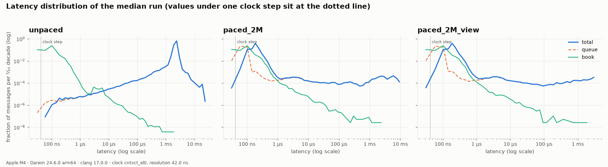
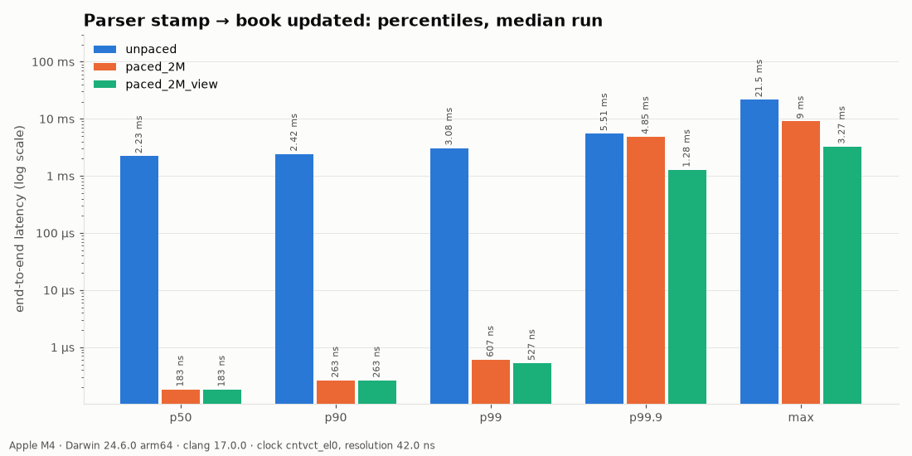
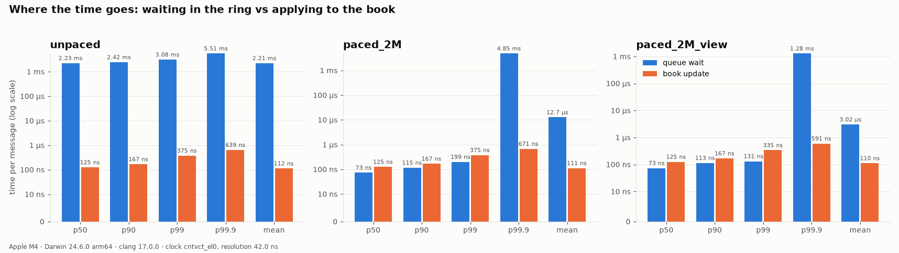
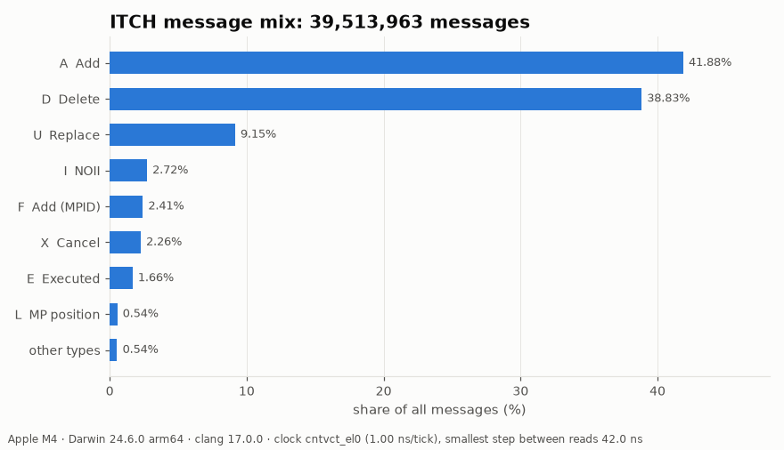
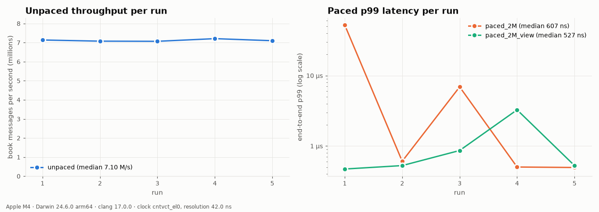
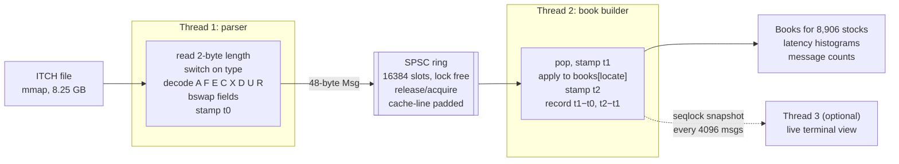

# ITCH 5.0 feed handler


[](https://github.com/Tharun-Maheswararao/itch_feed_handler/actions/workflows/ci.yml)

This program replays a full trading day of real Nasdaq TotalView-ITCH 5.0 data
(**268,744,780 messages, 8.25 GB**) through a two-thread pipeline: a parser, a
lock-free SPSC ring, and an order-book builder. It rebuilds the book for every
stock and reports end-to-end tail latency.

The optimized book is checked against a deliberately simple golden model
**after every one of the 263 M book messages**, using a running hash of book
state.

## Results

> **Host:** Apple M4 (4 performance + 6 efficiency cores), 16 GB RAM, macOS
> 15.6.1, Apple clang 17.0.0, `-O3 -mcpu=native`. Clock: `cntvct_el0`, 1 GHz
> units, **measured resolution 42 ns**.
> **Caveat:** macOS cannot pin threads, and this machine was swapping (the
> 8.25 GB file does not fit in its page cache next to other apps). These are
> indicative numbers. The official pinned run is
> [`bench/run_benchmark.sh`](bench/run_benchmark.sh) on a Linux EC2 instance;
> see [Reproducing on Linux](#reproducing-on-linux).

**Correctness: the optimized two-thread pipeline equals the golden model**
([log](results/logs/verify_full_day.txt), [noon cut](results/logs/verify_until_noon.txt)):

| Check | Full day | Cut at 12:00:00 |
|---|---|---|
| Book messages compared | 263,250,843 | 132,659,542 |
| Per-message hash chain (digest after *every* message) | ✅ identical (251 checkpoints) | ✅ identical (126 checkpoints) |
| Full book state, every level of every stock | ✅ (book is empty at end of day) | ✅ **1,771,377 live orders** |
| Invariants (level = Σ orders, sorted, no duplicates) | ✅ both books | ✅ both books |
| Unknown refs / overfills / duplicate adds | 0 / 0 / 0 | 0 / 0 / 0 |

**End-to-end latency** (parser stamp → book updated; median of 5 runs after 1 warmup):

| Configuration | Book msgs | Throughput | p50 | p90 | p99 | p99.9 | max |
|---|---:|---:|---:|---:|---:|---:|---:|
| **unpaced**, full day | 263.3 M | **7.10 M msgs/s** (7.07–7.21) | 2.23 ms | 2.42 ms | 3.08 ms | 5.51 ms | 21.5 ms |
| **paced 2 M msgs/s**, 04:00–10:00 | 38.0 M | 2.00 M msgs/s | **183 ns** | **263 ns** | **607 ns** | 4.85 ms | 9.00 ms |
| paced 2 M msgs/s, **live view on** | 38.0 M | 2.00 M msgs/s | 183 ns | 263 ns | 527 ns | 1.28 ms | 3.27 ms |

**Book update alone** (t2 − t1), every run of every configuration: **p50
125 ns, p99 335–375 ns, mean 110–116 ns**.

**Components** ([micro_bench log](results/logs/micro_bench.txt)):

| Component | Cost |
|---|---|
| Parser, data in page cache ([log](results/logs/parser_cached_2GB.txt)) | **~5 ns/msg: 170–206 M msgs/s, 5.2–6.4 GB/s** |
| Golden book (`unordered_map` + `std::map`) | 274–352 ns per book message |
| Fast book (open addressing + sorted vectors) | **63–67 ns per book message, 4.1–5.6× faster** |
| SPSC ring, 48-byte messages, 2 threads | 18–34 ns/msg (29–55 M msgs/s), unpinned |

Ranges span two separate benchmark sessions. The golden model swings more
because its `std::map` nodes are scattered across memory, so it suffers most
when the machine is paging.

**How to read this honestly:**

* **Unpaced** is a throughput test. The parser decodes over 10× faster than the
  book applies, so the ring is always full and each message waits for the
  ~16k ahead of it. The 2.2 ms "latency" is that backlog
  (16384 × ~140 ns), not a property of the code.
* **Paced** releases messages on a fixed schedule at about 30% of book
  capacity, as a feed would arrive. On macOS it replays 04:00–10:00, which
  includes the opening cross and fits in RAM. Across all ten paced runs,
  **p50 is 183–187 ns and p90 is 255–279 ns**.
* **The tail beyond p99 is the machine, not the code.** Paced p99 was
  471 ns–6.9 µs in nine of ten runs and 52 µs in one
  ([chart](docs/throughput_runs.png)), but p99.9 and max reach milliseconds.
  Stamps use the *scheduled* arrival time (coordinated-omission correction),
  so when macOS deschedules a spinning thread for a few ms, every message
  that arrives meanwhile is charged the wait. Book-update p99 stayed at
  335–375 ns throughout. Pinned, isolated Linux cores are what remove this.
  An earlier session on the same Mac under heavier load (swapping) gave paced
  p99 from 7 µs to 193 ms. The code was identical; the machine was busier.
* **The live view does not affect the pipeline:** p50 (183 ns), p90
  (263 ns) and book-update time are identical with it on and off. The tail
  differences between the two are run-to-run OS noise, which goes both ways.
* A first attempt paced at 5 M msgs/s over the full day (about 74% load, with
  the file paging from SSD) gave a p50 of 65–139 µs and a p99 from
  17 ms to 1.8 s. It is kept in
  [`results/logs/first_attempt_paced_5M/`](results/logs/first_attempt_paced_5M)
  and is why the paced configuration changed.
* On M4, `mean book update` in the pipeline (~112 ns) is higher than the
  single-threaded 63–67 ns. The measured region includes two serializing
  `isb; mrs` clock reads, and the message line arrives from the other core.

### Charts

All five charts are rebuilt from the CSVs in [`results/`](results) by
`python3 scripts/plot_results.py`.







### Reproducing on Linux

The benchmark spec calls for Linux with pinned cores. On a compute-optimized
EC2 instance (e.g. `c7i.2xlarge`, or `c7g` for Graviton) with at least 16 GB
RAM, so the whole day stays in page cache:

```bash
sudo dnf install -y gcc-c++ cmake git python3-pip && pip3 install pandas matplotlib pillow
git clone https://github.com/Tharun-Maheswararao/itch_feed_handler.git && cd itch_feed_handler
curl -L -o data/12302019.NASDAQ_ITCH50.gz "https://emi.nasdaq.com/ITCH/Nasdaq%20ITCH/12302019.NASDAQ_ITCH50.gz" && gunzip -k data/12302019.NASDAQ_ITCH50.gz
sudo cpupower frequency-set -g performance   # optional: stable clocks
bench/run_benchmark.sh data/12302019.NASDAQ_ITCH50
```

On Linux the script pins the parser and book threads to two physical cores and
replays the **full day** in every configuration. It writes the CPU model, core
count, compiler, flags and clock to every CSV row and regenerates every chart
in `docs/`.


## Architecture



| Component | Implementation | File |
|---|---|---|
| Parser | mmap, length-prefixed walk, `memcpy`+`bswap`, decodes only the 8 book types, counts all 23 | [`parser.hpp`](include/fh/parser/parser.hpp) |
| Message | 48 bytes, fixed size: cycle stamp, ITCH time, ref, new ref or symbol, price, shares, locate, type, side | [`message.hpp`](include/fh/parser/message.hpp) |
| SPSC ring | power-of-two, owner-written head and tail on separate cache lines, cached opposite index, release/acquire, busy spin | [`spsc_queue.hpp`](include/fh/queue/spsc_queue.hpp) |
| Golden book | `std::unordered_map` + `std::map` per side: the reference, never optimized | [`golden_book.hpp`](include/fh/book/golden_book.hpp) |
| Fast book | open-addressing order map (Fibonacci hash, backward-shift delete) + sorted level vectors, touch at the back | [`fast_book.hpp`](include/fh/book/fast_book.hpp), [`order_map.hpp`](include/fh/book/order_map.hpp) |
| Latency | `rdtsc` / `cntvct_el0` / `steady_clock`, log-linear fixed-array histogram, no allocation | [`clock.hpp`](include/fh/stats/clock.hpp), [`histogram.hpp`](include/fh/stats/histogram.hpp) |
| Live view | seqlock snapshot, own thread, ANSI redraw once per second | [`seqlock.hpp`](include/fh/view/seqlock.hpp), [`live_view.cpp`](src/live_view.cpp) |

Every design choice, and what I would change next, is in **[docs/DESIGN.md](docs/DESIGN.md)**.

## Build and run

Requirements: a C++20 compiler (clang ≥ 15 or gcc ≥ 12), CMake ≥ 3.20, and
Python 3 with pandas, matplotlib and Pillow for the charts. GoogleTest is
fetched automatically.

```bash
cmake -S . -B build -DCMAKE_BUILD_TYPE=Release && cmake --build build -j
ctest --test-dir build --output-on-failure
```

Get the data (see [data/README.md](data/README.md)):

```bash
curl -L -o data/12302019.NASDAQ_ITCH50.gz "https://emi.nasdaq.com/ITCH/Nasdaq%20ITCH/12302019.NASDAQ_ITCH50.gz" && gunzip -k data/12302019.NASDAQ_ITCH50.gz
```

| Command | What it does |
|---|---|
| `feed_handler count FILE --repeat 2` | parse only; message mix; checks counts match across passes |
| `feed_handler golden FILE --at 10:00:00,15:59:00` | single-threaded golden model; invariants; top of book at given times |
| `feed_handler verify FILE [--until 12:00:00]` | golden vs two-thread pipeline: per-message hash chain + full book state |
| `feed_handler bench FILE --runs 5 --warmup 1 [--rate N] [--cpu-producer A --cpu-consumer B]` | timed runs, median, CSVs |
| `feed_handler bench FILE --runs 1 --warmup 0 --view AAPL --speedup 5 --pace-from 09:30:00 --out results/logs/demo_view` | the live terminal view |
| `feed_handler gen OUT --events N` | synthetic ITCH feed (used by CI) |
| `micro_bench FILE` | parse-only, golden vs fast book, raw SPSC transfer |

**Everything (benchmarks, CSVs and all five charts) from one command:**

```bash
bench/run_benchmark.sh data/12302019.NASDAQ_ITCH50
```

On Linux the script pins the parser and the book thread to two physical cores
(never core 0, never hyperthread siblings). To regenerate the charts from
existing CSVs, run `python3 scripts/plot_results.py`.

## Testing

| Test | What it proves |
|---|---|
| [`test_parser`](tests/test_parser.cpp) | every field of every book type decodes correctly from hand-written bytes, including byte order, the 48-bit timestamp, and price scaling (`1234500` → `$123.45`); skip, malformed and truncated paths |
| [`test_spsc_queue`](tests/test_spsc_queue.cpp) | every item arrives once and in order on rings of 2, 64 and 16384 slots (**2.5 billion items run locally**, set with `FH_SPSC_ITEMS`); 48-byte payloads never tear |
| [`test_order_map`](tests/test_order_map.cpp) | 400k-step random churn against `std::unordered_map`, wrap-around, backward-shift delete, growth |
| [`test_book`](tests/test_book.cpp) | the same edge cases on **both** books: replace that moves level, replace priced through the other side (stays on its side), execution that empties a level, delete of the last order (hash returns to 0), unknown refs, overfill, deep books |
| [`test_golden_compare`](tests/test_golden_compare.cpp) | fast book equals golden after every message; the two-thread pipeline (fast and golden books, paced and unpaced, view on) produces the identical per-message hash chain |
| Invariants | each level's shares and order count equal the sum of its orders, levels are strictly sorted, no order is in two places |
| [`test_histogram`](tests/test_histogram.cpp), [`test_seqlock`](tests/test_seqlock.cpp) | bucket math and error bound; no torn snapshot across 3M concurrent writes |

CI ([`.github/workflows/ci.yml`](.github/workflows/ci.yml)) runs on every
push. It builds with gcc and clang on Linux and clang on macOS, in Release and
Debug, and runs ASan+UBSan and TSan builds. An end-to-end job generates a
synthetic feed and runs count → golden → verify → bench → charts.

## Repository layout

```
include/fh/parser/   endian helpers, message struct, parser, mmap wrapper
include/fh/queue/    SPSC ring buffer
include/fh/book/     golden book, fast book, order map, hashing, comparison
include/fh/stats/    clock, histogram, report/CSV
include/fh/view/     seqlock, snapshot, live view
include/fh/testing/  ITCH encoder + synthetic feed generator
include/fh/pipeline.hpp   two-thread pipeline and single-thread reference run
src/                 CLI, report, sysinfo, live view
tests/               GoogleTest suites
bench/               micro-benchmarks, one-command benchmark script
scripts/             plot_results.py (charts), make_gif.py (README GIF)
docs/                charts, GIF, design document
results/             CSV output and logs from the runs shown above
```
